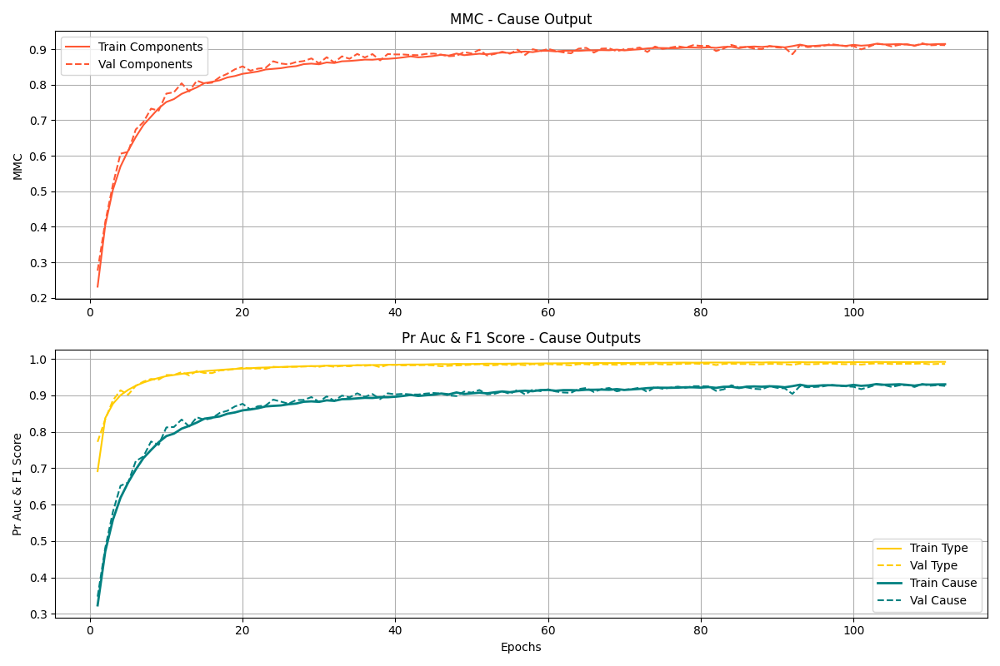

# 🚀 NLP Multi-Label and Multi-Output Text Classification for Vehicle Complaints

# Version: 2.0

**Description:** This project aims to develop a Machine Learning pipeline for the automatic classification of vehicle complaints based on customer reports. The proposed model is capable of identifying the affected component, the type of problem, and the possible cause of the defect in the vehicle. Implementing this solution will enable Ford to identify recurring complaint patterns, anticipate potential recall needs, and provide a preliminary categorization before professional analysis. By accurately classifying the reported issues, the company can take more effective corrective actions and streamline the service process.

The model was trained on a dataset of vehicle complaints collected from the NHTSA website between 2020 and 2025.

**Technologies Used:** Python, TensorFlow/Keras, BERT, NLP, Pandas, Scikit-learn

**Impact** : This solution helps automakers detect complaint patterns, anticipate recalls, and improve vehicle safety by classifying potential issues in reported cases.


## *Project Setup*

To set up the project environment, you have two options. You can either use the `setup.py` script or create the environment manually using the `env.yml` file. Choose the option that works best for you.

### Option 1: Using the `setup.py` script

1. Make sure you have Python and `pip` installed on your machine.
2. Run the following command in the terminal to install the required dependencies:

   ```bash
   python setup.py install
   ```

### Option 2: Using the `env.yml` file

1. Ensure that you have Conda installed on your machine.
2. Create the environment using the following command:

   ```bash
   conda env create -f env.yml
   ```

 3. Once the environment is created, activate it with:
      ```bash
    conda activate ford_case_iel
      ```

## **Project Structure**

The project is organized with clearly defined folders and adheres to coding standards. Functions are modularized and classes are implemented with proper documentation via docstrings and type hints, ensuring clarity and ease of maintenance. Additionally, the configuration and orchestration of environment variables are efficiently managed using Hydra.

The project comprises the following steps:
- Automatic data download and setup;
- Data processing;
- Model training;
- Evaluation of performance metrics.

---
## Download and Setup

The project was developed using a Conda environment. Upon starting, it checks if the necessary environment is already configured; if not, the system creates the environment and automatically installs the required dependencies. Moreover, there is a function that validates the local presence of the database. If the database is not available, the project accesses the NHTSA API, retrieves complaints for the requested years, and combines the data for processing.

---

## Data Processing

Data processing is divided into three main parts:

### Modularization
The code is modularized into three main classes:
- **TextProcessor:** Responsible for text pre-processing.
- **FeatureExtractor:** Uses Facebook's pre-trained RoBERTa model to generate embeddings from text.
- **CategoryTransformer:** Transforms categorical variables and extracts problem types and causes.

### Text Processing
Various techniques are applied to clean and normalize the data, such as:
- Removal of special characters and punctuation;
- Elimination of stop words;
- Tokenization and lemmatization of words.

Subsequently, the pre-trained RoBERTa model is used to transform the text into vector representations, capturing the semantic content.

### Target Categories Creation
The model is configured to return three outputs:
- **Component:** A multi-label category corresponding to the affected component.
- **Type:** A multi-label category for the type of problem encountered.
- **Cause:** A multi-label category that describes the cause of the problem.

While the *Component* category is already present and categorized in the NHTSA dataset, the *Type* and *Cause* categories were created based on a mapping of the most frequent words found in the text descriptions, enabling their proper extraction and handling.

After categorizing the target variables, a distribution analysis was conducted. A significant gap between the most and least frequent categories was observed, which could negatively impact the model's evaluation metrics. Approaches such as oversampling (using MLSmote, Weighted Training, and Focal Loss) were tested, but further refinement is required to address the challenges of a multi-label problem with three outputs.

---

## Model Training

### Variables and Tuning
To manage model variables in an organized and scalable manner, the Hydra framework was used, allowing dynamic configuration of hyperparameters during training.

### Hyperparameter Optimization
The selection of the best hyperparameters was carried out using Bayesian Optimization, a probabilistic model-based method that predicts the most promising parameter combinations. Based on the loss function, the optimal parameters were identified and applied in the final training to ensure a balance between performance and generalization.

### Neural Network Architecture
The model is a multi-output neural network, designed to predict multiple labels simultaneously. Its architecture includes:
- A shared base composed of three dense layers;
- Techniques to improve generalization and prevent overfitting, such as:
  - **L2 Regularization:** Applies a penalty to the network weights.
  - **Batch Normalization:** Normalizes activations in each batch.
  - **Dropout:** Randomly deactivates a percentage of neurons to prevent over-reliance on specific units.
  
Each of the three outputs has an independent final branch consisting of three dense layers, ending with a sigmoid activation layer, which is appropriate for multi-label classification problems.

---

## Model Evaluation

Given the imbalanced nature of the data, metrics that handle such scenarios were chosen:
- **Matthews Correlation Coefficient (MCC):** Provides a balanced view by considering true positives, true negatives, false positives, and false negatives.
- **F1-Score:** Balances precision and recall, making it suitable for imbalanced scenarios.
- **AUC-PR:** Evaluates the prediction quality by considering the precision-recall trade-off.

Since Keras does not provide native support for MCC and F1-Score, custom functions were implemented based on their respective mathematical formulas. The results indicate that the model not only learned relevant patterns but also managed to balance the classification between majority and minority classes, demonstrating good generalization without clear signs of overfitting or underfitting.

---

## Final Considerations

The model effectively identified important patterns in vehicle complaints and efficiently balanced the classification across various categories. Despite the inherent challenges of a multi-label problem with three outputs, the adopted approach provides a solid foundation for future enhancements, such as optimized oversampling techniques to address imbalances and fine-tuning of the neural network architecture.

<p align="center">
  
  
  
</p>